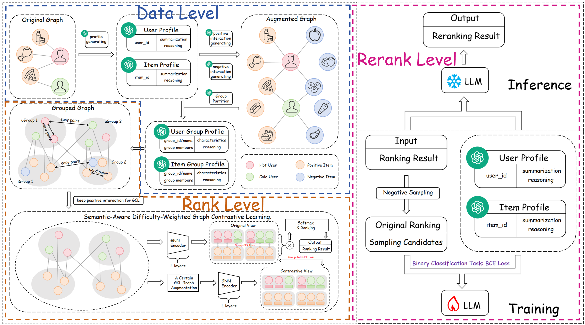

This is the PyTorch implementation of the proposed model LAGCL4Rec.
<br>

<p align='center'>
<br>
<i>Figure: The Framework of LAGCL4Rec</i>
</p>

<br>
We developed our code in the following environment:
<br>

```
Python == 3.12
torch == 2.5.1
```

We provide the ml-1m example dataset and XSimGCL implementation code. To execute this code:
1. Because GitHub has file size restrictions, you first need to run ./dataset/ml-1m/merge_profiles.py to generate merged_profiles.json.
2. First you need to disable reranking
3. Train the rank model
4. Output cf_candidates.json
5. Download the model (Qwen2.5 7b instruct) to the ./rerank/model directory
6. Train the Qwen model
7. After the Qwen model training is complete, you can use LAGCL4Rec normally